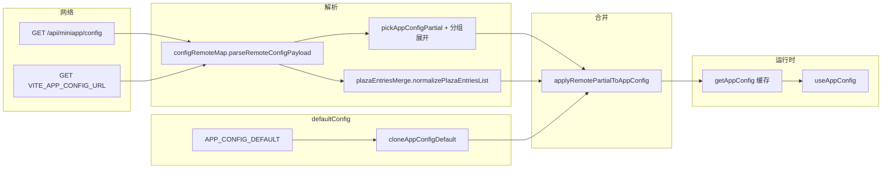

# 小程序配置读取链路（Phase 14 收口说明）

## 1. 配置读取链路总览

| 步骤 | 位置 | 说明 |
|------|------|------|
| 默认快照 | `config/defaultConfig.ts` | `cloneAppConfigDefault()`、`APP_CONFIG_*_KEYS` |
| 远端拉取 | `api/config.ts` | `fetchBffMiniappConfig`、`fetchStaticAppConfigUrl`，失败返回 `{}` |
| 形状映射 | `api/configRemoteMap.ts` | 剥包装层、分组对象、camelCase、扁平 snake 字段 |
| 布尔与文案 | `defaultConfig.pickAppConfigPartial` + `parseBooleanLike` | 根级布尔；运营位 `show` 等在 RemoteMap 内处理 |
| 广场排序 | `lib/plazaEntriesMerge.ts` | `sort_order` 归一、`mergePlazaWithDefaults` 后 **升序排序** |
| 合并规则 | `api/config.ts` | 非空字符串覆盖布尔；`plaza_entries` 与默认按 `key` 合并 |
| 页面消费 | `useAppConfig` + 少量 composable | 不写合并逻辑 |

---

## 2. 哪些配置已「真实接远端」

在 **已配置** `VITE_API_BASE_URL`（且后端返回合法 JSON）或 `VITE_APP_CONFIG_URL` 时，下列字段均可被远端覆盖（否则整段保持默认）：

- **首页基础**：`home_title`、`home_subtitle`（及分组 `home`）
- **首页运营位**：`home_banner_*`、`show_home_banner`、`home_recommend_*`、`show_home_recommend`、`home_hot_*`、`show_home_hot`（及对应分组块）
- **功能广场**：`plaza_title`、`plaza_subtitle`、`plaza_entries`（数组或 `plaza.entries` 等别名）
- **我的（账号区文案）**：`profile_title`、`profile_subtitle`、`profile_guest_title`、`profile_guest_subtitle`（及分组 `profile` / `profile_guest`）— *当前「我的」未登录主文案已切到全局 `login_prompt_*`，但字段仍可从远端配置供其它场景或后续使用*
- **收藏 / 历史页**：`favorites_*`、`histories_*`、`show_recent_favorites`、`show_recent_histories`（及分组 `favorites` / `histories`）
- **全局文案 / Toast / 未登录空态**：`login_prompt_*`、`login_button_text`、`toast_*`、`common_empty_*`（及分组 `login` / `toasts` / `common_empty`）

未配置任何远端 URL 或请求失败时：**行为上等价于「全部走默认」**，不因缺字段抛错。

---

## 3. 哪些字段仍主要走默认值

- **未接远端、且无 `AppConfig` 字段的 UI 文案**：如部分 `pages.json` 固定导航标题（收藏/历史除外，会由配置同步导航栏）、`meCopy` 里退出确认、`plaza` 内「敬请期待」等 Toast、登录页校验提示等。
- **`profile_guest_*`**：默认仍存在且可被远端覆盖，但「我的」页未登录态展示已优先使用 `login_prompt_*`；若后台只配 `profile_guest` 而未配 `login_prompt`，小程序未登录头图仍以 `login_prompt_*` 默认为准。

---

## 4. 预留 / 扩展结构

- **`PlazaEntryConfig.coming_soon`**：数据模型与 UI 占位已支持，远端可开关「敬请期待」态。
- **`toast_favorite_success` / `toast_favorite_cancel`**：已在 `AppConfig` 与 `useAppMessages` 预留，待收藏切换入口接入后调用。
- **广场 `enabled`、排序**：合并层已处理；页面通过 `useVisiblePlazaEntries` 只读展示，不重复过滤语义。

---

## 5. 页面侧辅助 composable（不修改配置语义）

| Composable | 用途 |
|------------|------|
| `useAppConfig` | `Ref<AppConfig>` + hydrate |
| `useNavigationBarTitleFromConfig` | 收藏/历史页导航标题与配置同步 |
| `useRecentPartitionedList` | 收藏/历史「最近」与主列表分区 |
| `useVisiblePlazaEntries` | 广场列表 `enabled` 过滤 |
| `useAppMessages` | Toast 文案读配置 |

新增配置字段时推荐顺序：在 `AppConfig` 与 `APP_CONFIG_*_KEYS` 登记 → `configRemoteMap` 增加映射 → `APP_CONFIG_DEFAULT` 兜底 → 页面只绑定 `config.xxx`。
